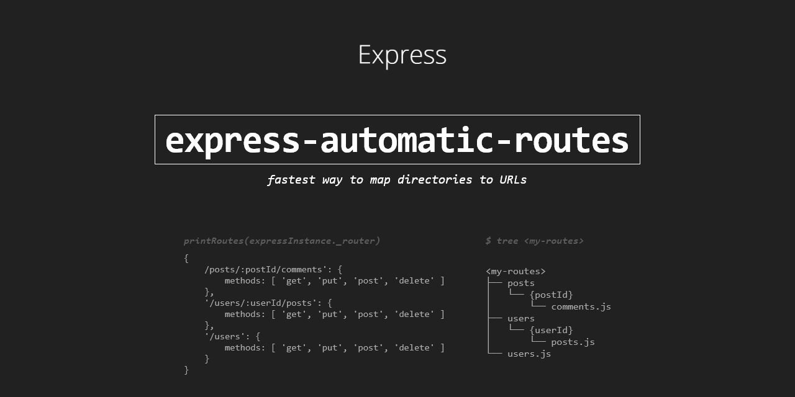

# express-automatic-routes

<div align="center">



 &nbsp; 

[](https://www.npmjs.com/package/express-automatic-routes)
[](https://www.npmjs.com/package/express-automatic-routes)
[](https://snyk.io/test/github/GiovanniCardamone/express-automatic-routes)
[](https://github.com/GiovanniCardamone/express-automatic-routes/blob/master/LICENSE)


[](https://coveralls.io/github/GiovanniCardamone/express-automatic-routes?branch=master)

</div>

> :star: Thanks to everyone who has starred the project, it means a lot!

Plugin to handle routes in express automatically based on directory structure.

## :newspaper: **[Full Documentation](https://giovannicardamone.github.io/express-automatic-routes/)**

[express-automatic-routes](https://giovannicardamone.github.io/express-automatic-routes/)

## :rocket: Install

```sh
npm install --save express-automatic-routes
```

## :blue_book: Usage

### Autoload routes

```js
import express from 'express'
import autoroutes from 'express-automatic-routes'

const app = express()

autoroutes(app, {
  dir: './<autoroutes-directory>' // relative to your cwd
})
```

### Create file in autoroutes directory

```js
//file: `<autoroutes-directory>/some/route.js`
//url:  `http://your-host/some/route`

export default (expressApp) => ({
  get: (request, response) {
    response.status(200).send('Hello, Route').end()
  }
})
```

### Using typescript support for module

```typescript
//file: `<autoroutes-directory>/some/route.ts`
//url:  `http://your-host/some/route`

import { Application, Request, Response } from 'express'
import { Resource } from 'express-automatic-routes'

export default (express: Application) => <Resource> {
  get: (request: Request, response: Response) {
    response.status(200).send('Hello, Route!').end()
  }
}
```

### Accepts params in autoroutes

> :information_source: file/directory name must follow syntax `:paramName` or `{paramName}`

```js
//file: `<autoroutes-directory>/users/{userId}/photos.js`
//mapped to: `<your host>/users/:userId/photos`

export default (expressApp) => ({
  get: (request, response) => {
      response.end(`photos of user ${request.params.userId}`)
  }
})
```

## :arrow_forward: Module definition

each file must export a function that accept express as parameter, and return an object with the following properties:

```javascript
export default (expressApp) => ({
  middleware: [ /* your middlewares */ ]
  delete: { /* your handler logic */},
  get: { /* your handler logic */  },
  head: { /* your handler logic */  },
  patch: { /* your handler logic */  },
  post: { /* your handler logic */  },
  put: { /* your handler logic */  },
  options: { /* your handler logic */  },
})
```

## :arrow_forward: Middleware module definition

the `middleware` parameter can be one of the following:

- `undefined` _(just omit it)_
- `Middleware function` _(a function complain to [express middleware](https://expressjs.com/en/guide/using-middleware.html) definition)_
- `An Array of Middleware functions`

example:

> :information_source: simple middleware

```javascript
export default (expressApp) => ({
  middleware: (req, res, next) => next()
  /* ... */
})
```

> :information_source: array of middleware

```javascript
const m1 = (req, res, next) => next()
const m2 = (req, res, next) => next()

export default (expressApp) => ({
  middleware: [m1, m2]
  /* ... */
})
```

## :arrow_forward: Route definition

A route can be a function (likes middleware but without `next` parameter) or an object who has the following properties:

- middleware // same as module middleware
- handler // the handler of the function

examples:

> :information_source: simple route method

```javascript
export default (expressApp) => ({
  get: (req, res) => res.send('Hello There!')
})
```

> :information_source: route method with middleware(s)

```javascript
export default (expressApp) => ({
  get: {
    middleware: (req, res, next) => next()
    handler: (req, res) => res.send('Hello There!')
  }
})
```

## :arrow_forward: Skipping files

to skip file in routes directory, prepend the `.` or `_` charater to filename

examples:

```text
routes
├── .ignored-directory
├── _ignored-directory
├── .ignored-js-file.js
├── _ignored-js-file.js
├── .ignored-ts-file.ts
├── _ignored-ts-file.ts
├── ignored-js-test.test.js
└── ignored-ts-test.test.ts
```

> :warning: also any `*.test.js` and `*.test.ts` are skipped!

this is useful if you want to have a lib file containts functions that don't have to be a route, so just create the file with `_` prepending character

## :page_facing_up: License

Licensed under [MIT](./LICENSE)

## :sparkles: Contributors

Thanks goes to these wonderful people ([emoji key](https://allcontributors.org/docs/en/emoji-key)):

<!-- ALL-CONTRIBUTORS-LIST:START - Do not remove or modify this section -->
<!-- prettier-ignore-start -->
<!-- markdownlint-disable -->
<table>
  <tr>
    <td align="center"><a href="http://giovannicardamone.github.io"><br /><sub><b>Giovanni Cardamone</b></sub></a><br /><a href="https://github.com/GiovanniCardamone/express-automatic-routes/commits?author=GiovanniCardamone" title="Code">💻</a> <a href="https://github.com/GiovanniCardamone/express-automatic-routes/commits?author=GiovanniCardamone" title="Documentation">📖</a> <a href="#example-GiovanniCardamone" title="Examples">💡</a> <a href="#maintenance-GiovanniCardamone" title="Maintenance">🚧</a></td>
  </tr>
</table>

<!-- markdownlint-restore -->
<!-- prettier-ignore-end -->
<!-- ALL-CONTRIBUTORS-LIST:END -->

This project follows the [all-contributors](https://github.com/all-contributors/all-contributors) specification.

Contributions of any kind welcome!
